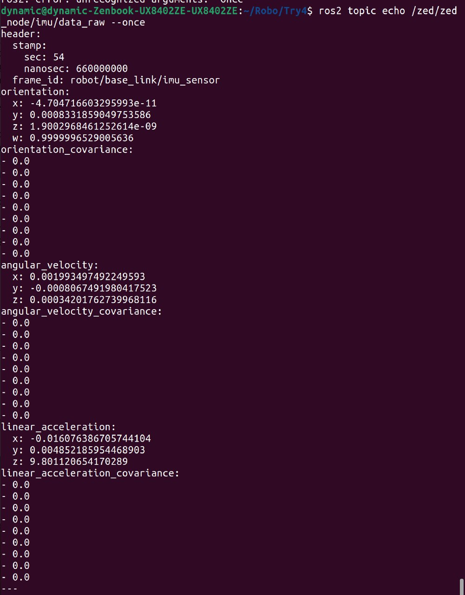
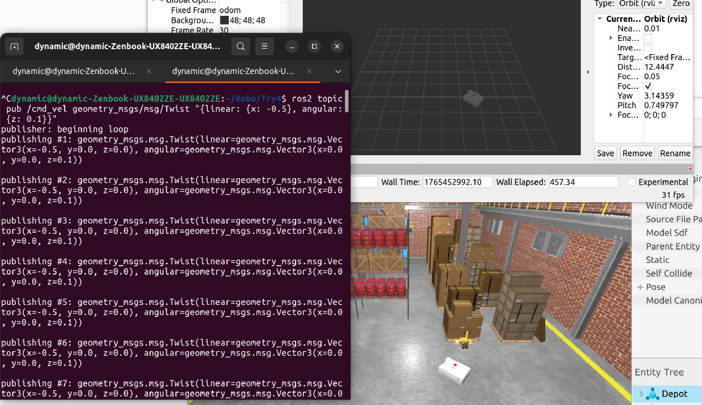
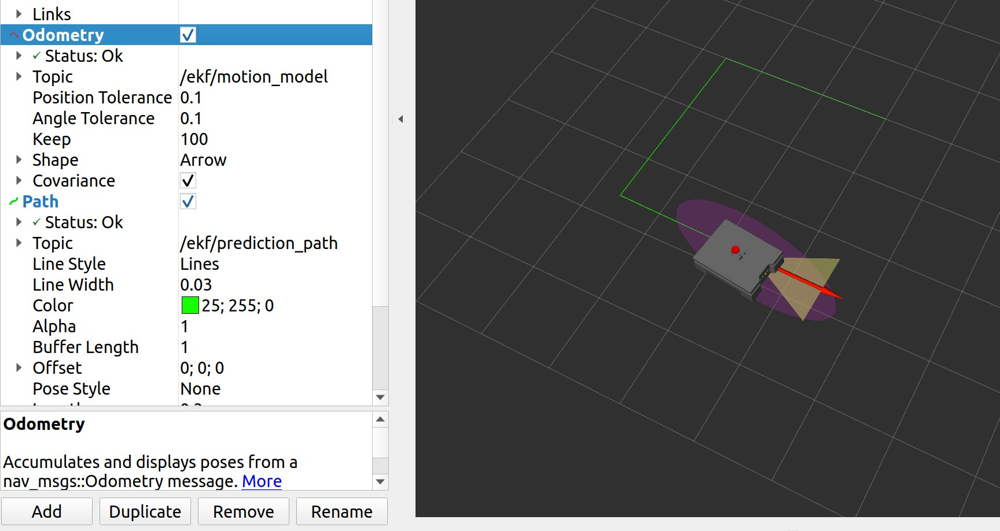
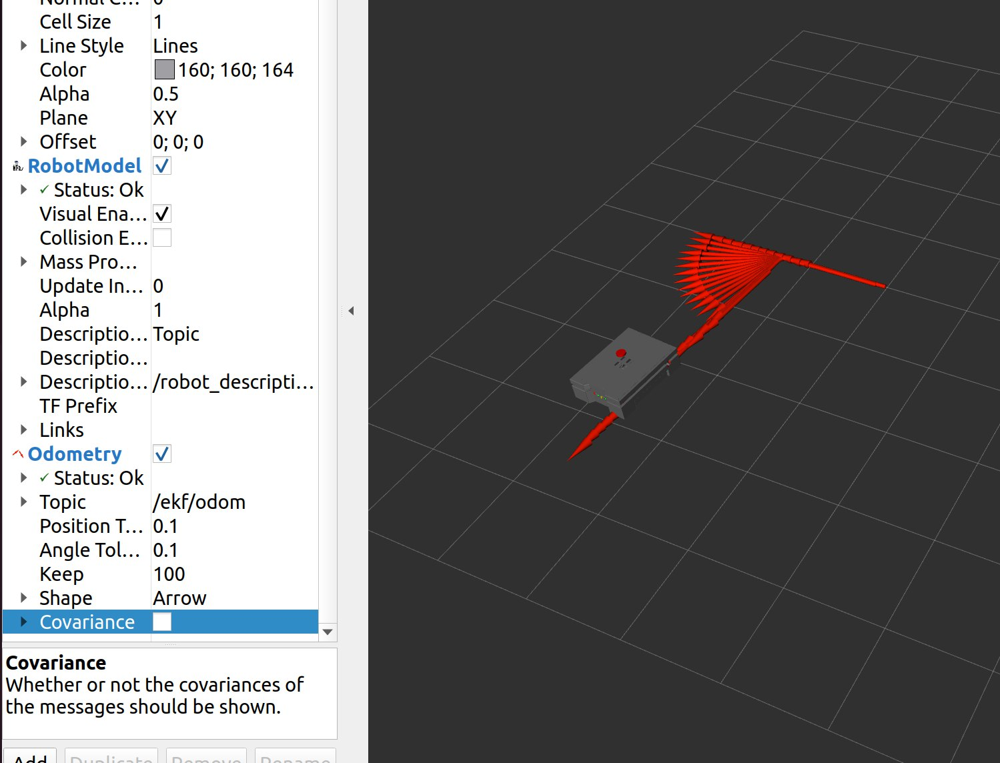
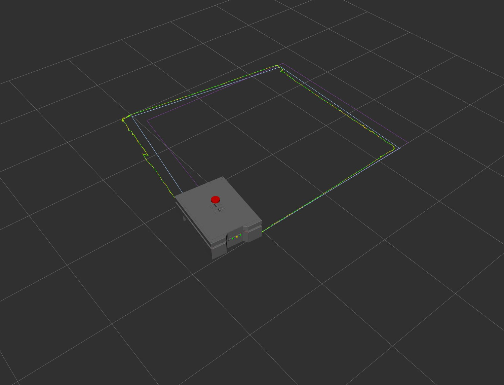
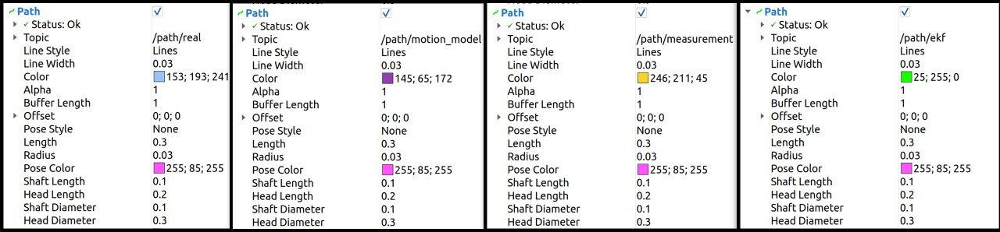
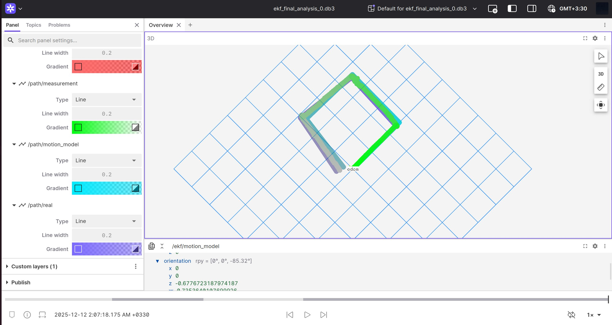

# Mobile Robot State Estimation (Skid–Steer Robot)

## 🎯 Objective

Understand and implement different **state estimation** methods for mobile robots.  
Students will apply:

- Bayes Filters  
- Kalman Filter (KF)  
- Extended Kalman Filter (EKF)  

All methods are to be tested **in simulation**, integrating **ROS2** and **Gazebo** with a four–wheeled **skid–steering** mobile robot.

---

## 🤖 Robot Model and Parameters

We consider a 4-wheeled skid–steer robot. Each side (left / right wheels) moves with the **same speed**.

The robot state at time step \(k\) is

$$
\mathbf{x}_k =
\begin{bmatrix}
x_k \\
y_k \\
\theta_k
\end{bmatrix},
$$

where

- \($x_k, y_k$\): position of the robot in the world frame  
- \($\theta_k$\): heading (yaw) angle

Control inputs at time step \(k\) are

$$
\mathbf{u}_k =
\begin{bmatrix}
v_{x,k} \\
\omega_{z,k}
\end{bmatrix},
$$

where

- \($v_{x,k}$\): linear velocity of the robot body (forward)  
- \($\omega_{z,k}$\): angular velocity around the vertical \(z\)-axis  

The robot geometry and timing are summarized by the following parameters:

| Symbol | Name              | Description                               |
|--------|-------------------|-------------------------------------------|
| \($v_x$\) | Linear velocity   | Forward velocity of the robot base       |
| \($\omega_z$\) | Angular velocity | Yaw rate (rotation around vertical axis) |
| \(r\)  | Wheel radius      | Radius of each driving wheel             |
| \(w\)  | Wheel separation  | Lateral distance between left and right wheel sets (track width) |
| \(x\)  | State variable    | Robot position along global \(X\) axis   |
| \(y\)  | State variable    | Robot position along global \(Y\) axis   |
| \($\theta$\) | State variable | Robot heading angle                      |
| \($\Delta t$\) | Time step   | Sampling period of the discrete model    |

> In practice, the wheel angular velocities \(\omega_L, \omega_R\) can be mapped to body velocities \(v_x, \omega_z\) using \(r\) and \(w\), but here we work directly with \(v_x\) and \(\omega_z\).

---

## 🧠 Motion Model (Discrete-Time Skid–Steer Kinematics)

Using the standard unicycle / skid–steer kinematic approximation, the discrete-time motion model with sampling time \($\Delta t$\) is

$$
\mathbf{x}_{k+1} = f(\mathbf{x}_k,\mathbf{u}_k) + \mathbf{w}_k,
$$

with

$$
f(\mathbf{x}_k,\mathbf{u}_k) =
\begin{bmatrix}
x_k + v_{x,k}\cos\theta_k\,\Delta t \\
y_k + v_{x,k}\sin\theta_k\,\Delta t \\
\theta_k + \omega_{z,k}\,\Delta t
\end{bmatrix},
$$

and process noise

$$
\mathbf{w}_k \sim \mathcal{N}(0,\mathbf{Q}_k).
$$

### Jacobian of the Motion Model

The Jacobian with respect to the state (used in the EKF) is

$$
\mathbf{F}_k =
\frac{\partial f}{\partial \mathbf{x}} =
\begin{bmatrix}
1 & 0 & -v_{x,k}\sin\theta_k\,\Delta t \\
0 & 1 &  v_{x,k}\cos\theta_k\,\Delta t \\
0 & 0 & 1
\end{bmatrix}.
$$

---

## 🎯 Measurement Model (RGB-D + IMU)

The robot is equipped with:

- an **RGB-D camera** that provides **visual odometry**  
  \(($\Delta x, \Delta y$)\) per time step, which after integration yields an estimated position \(($x_k^{vo}, y_k^{vo}$)\);
- an **IMU** that provides an estimate of the **orientation**  
  \($\theta_k^{imu}$\).

We collect these into the measurement vector

$$
\mathbf{z}_k =
\begin{bmatrix}
x_k^{vo} \\
y_k^{vo} \\
\theta_k^{imu}
\end{bmatrix}.
$$

Assuming the sensors measure the true pose plus noise, the measurement model is

$$
\mathbf{z}_k = h(\mathbf{x}_k) + \mathbf{v}_k,
\qquad
h(\mathbf{x}_k) =
\begin{bmatrix}
x_k \\
y_k \\
\theta_k
\end{bmatrix},
$$

with measurement noise

$$
\mathbf{v}_k \sim \mathcal{N}(0,\mathbf{R}_k).
$$

### Jacobian of the Measurement Model

$$
\mathbf{H}_k =
\frac{\partial h}{\partial \mathbf{x}} =
\begin{bmatrix}
1 & 0 & 0 \\
0 & 1 & 0 \\
0 & 0 & 1
\end{bmatrix}.
$$

---

## 🔧 Extended Kalman Filter (EKF)

The EKF fuses the nonlinear motion model and the sensor measurements to estimate the robot state.

### 1. Prediction (Time Update)

Given the current estimate \($\hat{\mathbf{x}}_{k|k}$\) and covariance \($\mathbf{P}_{k|k}$\):

$$
\hat{\mathbf{x}}_{k+1|k} = f(\hat{\mathbf{x}}_{k|k},\mathbf{u}_k),
$$

$$
\mathbf{P}_{k+1|k} = \mathbf{F}_k\,\mathbf{P}_{k|k}\,\mathbf{F}_k^\top + \mathbf{Q}_k.
$$

### 2. Measurement Update (Correction)

When a new measurement \($\mathbf{z}_{k+1}$\) arrives:

**Innovation (residual)**

$$
\mathbf{y}_{k+1} = \mathbf{z}_{k+1} - h(\hat{\mathbf{x}}_{k+1|k}).
$$

**Innovation covariance**

$$
\mathbf{S}_{k+1}
= \mathbf{H}_{k+1}\mathbf{P}_{k+1|k}\mathbf{H}_{k+1}^\top + \mathbf{R}_{k+1}
$$

**Kalman gain**

$$
\mathbf{K}_{k+1}
= \mathbf{P}_{k+1|k}\mathbf{H}_{k+1}^\top
\mathbf{S}_{k+1}^{-1}.
$$

**Updated state estimate**

$$
\hat{\mathbf{x}}_{k+1|k+1}
= \hat{\mathbf{x}}_{k+1|k} + \mathbf{K}_{k+1}\mathbf{y}_{k+1}.
$$

**Updated covariance**

$$
\mathbf{P}_{k+1|k+1}
= (\mathbf{I} - \mathbf{K}_{k+1}\mathbf{H}_{k+1})\mathbf{P}_{k+1|k}.
$$

---
---

# 🚀 Implementation Details

The state estimation pipeline was implemented using the ROS framework, specifically focusing on low-level motor control, sensor noise modeling, and the construction of the Extended Kalman Filter (EKF) for state fusion.

### A. URDF Modification: Dual Motor Control

* **Task:** Replace the generic `diff_drive` Gazebo plugin with two explicit motors/joints controlled via RPM commands.
* **Implementation:** The robot's URDF file was modified to remove the differential drive plugin. Two `transmission` tags were added to link the left and right wheel joints to `velocity_controllers/JointVelocityController` instances, which allows for independent velocity (RPM) control via dedicated ROS topics. This setup simulates a more realistic control interface where motor commands (RPMs) are given directly.
---
### B. IMU Noise Addition

* **Task:** Add realistic noise characteristics to the IMU sensor model in Gazebo.
* **Implementation:** An IMU sensor was integrated into the robot's URDF, utilizing the `libignition-gazebo-imu-system` plugin. **Gaussian noise** parameters were explicitly configured within the sensor block (`<imu>`) for both the gyroscope (angular velocity) and accelerometer (linear acceleration) axes to simulate realistic sensor behavior, drift, and inaccuracy.
* **Configuration Details (Extract from URDF):**
    * Gyroscope Noise (Angular Velocity): Standard deviation $\sigma=0.001$ and Bias $\sigma_{bias}=0.0001$.
    * Accelerometer Noise (Linear Acceleration): Standard deviation $\sigma=0.01$ and Bias $\sigma_{bias}=0.001$.
* **Verification:** After launching the simulation, the raw IMU topic (`/zed/zed_node/imu/data_raw`) was monitored while the robot was static. The non-zero readings in angular velocity and linear acceleration confirmed the successful addition of sensor noise, crucial for testing the EKF's robustness.

> **Verification Screenshot:**
> 
---
C. Controller Node Implementation (C++)

* **Task:** Write a C++ ROS node to convert generic velocity commands (`geometry_msgs/Twist`) into motor specific speed commands (angular velocity in rad/s).
* **Implementation:** The `MotorControllerNode` (ROS 2 C++ node using `rclcpp`) subscribes to the standard `/cmd_vel` topic and implements the inverse kinematic model to calculate the required angular velocities ($\omega_L, \omega_R$) for the dual-motor model.
* **Parameter Loading:** The node dynamically loads the essential geometric parameters ($r, w$) using the ROS 2 parameter system (`this->declare_parameter`).
* **Inverse Kinematics (Implemented Logic):**
    The node calculates the required linear wheel speeds ($v_R, v_L$) and converts them to angular velocities ($\omega_R, \omega_L$):

  $$
    v_R = v_x + \frac{\omega_z \cdot w}{2} \qquad \omega_R = \frac{v_R}{r}
  $$
  
  $$
    v_L = v_x - \frac{\omega_z \cdot w}{2} \qquad \omega_L = \frac{v_L}{r}
  $$
  
    The resulting $\omega_L$ and $\omega_R$ are published as a `std_msgs/Float64MultiArray` message on the `/motor_commands` topic.
* **Verification:** Control was verified by successfully executing motions in Gazebo by manually publishing `geometry_msgs/Twist` messages to `/cmd_vel`.

> **Verification Screenshot:**
> 
---
### D. Prediction Node Implementation (Python)

* **Task:** Create a new ROS package (`robot_local_localization`) and implement a Python node (`prediction_node.py`) to perform the **Prediction Update** (Time Update) step of the EKF.
* **Structure:** A new package was created in the `robot_autonomy/src` folder. The node uses ROS 2 (`rclpy`).
* **Implementation:** The `prediction_node.py` subscribes to the `/cmd_vel` topic and uses the previous estimated state and the current control input to propagate the robot's pose ($\hat{\mathbf{x}}_{k+1|k}$) and its covariance ($\mathbf{P}_{k+1|k}$).
* **Key Features:**
    * **Parameterized:** Essential parameters (`wheel_separation`, `process_noise_v`, `process_noise_w`) are declared and loaded dynamically.
    * **Motion Model (Kinematics):** Implements the discrete-time unicycle kinematic model, handling both **straight motion** (when $\omega \approx 0$) and **turning motion** (using radius $R = v/\omega$).
    * **Covariance Update:** Calculates the Jacobian $\mathbf{F}_k$ for both motion cases and updates the covariance matrix: $\mathbf{P}_{k+1|k} = \mathbf{F}_k\,\mathbf{P}_{k|k}\,\mathbf{F}_k^\top + \mathbf{Q}_k$.
    * **Output:** Publishes the predicted pose and covariance as a standard `nav_msgs/Odometry` message on the `/ekf/motion_model` topic.
    * **Path Visualization:** Additionally, a `nav_msgs/Path` message is published on `/ekf/prediction_path` to visualize the dead reckoning (Motion Model) trace in RViz.

> **Verification Screenshot:** The motion model successfully traces the commanded path (a right-angle turn in this test), demonstrating the dead reckoning accuracy based on the kinematic model.
> 
---
### E. Measurement Node Implementation (Python)

* **Task:** Create a Python node (`measurement_node.py`) to fuse raw sensor data (IMU and Visual Odometry) into a combined measurement vector ($\mathbf{z}_k$) and covariance matrix ($\mathbf{R}_k$).
* **Implementation:** The node uses Python/ROS 2 (`rclpy`) and concurrently subscribes to the IMU topic (`/zed/zed_node/imu/data_raw`) and the Visual Odometry (VO) topic (`/vo/odom`).
* **Fusion Logic:**
    1.  **Orientation Source:** The node reads the **Yaw angle** ($\theta$) from the latest IMU message.
    2.  **Position Source:** The node reads the **X and Y position** from the VO message.
    3.  **Vector Construction:** The final combined measurement $\mathbf{z}_k = [x_k^{vo}, y_k^{vo}, \theta_k^{imu}]^T$ is constructed and published as an `nav_msgs/Odometry` message on `/measurement_model/odom`.
    4.  **Z-Axis Correction:** Since the Visual Odometry sensor provided a constant, non-zero reading for the Z-position (altitude) that was not relevant for ground navigation, the Z-position was manually set to $0.0$ in the published measurement, based on the assumption that the robot operates on a flat plane.
* **Covariance Calculation ($\mathbf{R}_k$):** The measurement covariance matrix is constructed block-diagonally, reflecting the combined sensor noise:
    * The $(x, x)$ and $(y, y)$ variance terms are taken from the respective entries in the incoming VO covariance (if available) or defined with a default value (e.g., $0.05^2$).
    * The $(\theta, \theta)$ variance term (index 35) is taken from the IMU's orientation covariance or a tunable parameter (`imu_yaw_stddev`).
---
### F. EKF Node Implementation (Python)

* **Task:** Implement the core Extended Kalman Filter (EKF) logic by fusing the motion model (Prediction Node, D) and the measurement model (Measurement Node, E).
* **Implementation:** The `ekf_node.py` is the central node, operating at a fixed rate (e.g., $100\,\text{Hz}$). It subscribes to the prediction output from Node D (`/ekf/motion_model`) and the combined measurement from Node E (`/measurement_model/odom`).
* **Core EKF Cycle:**
    1.  **Prediction (Time Update):** The node adopts the predicted pose ($\hat{\mathbf{x}}_{k|k-1}$) and covariance ($\mathbf{P}_{k|k-1}$) directly from the dedicated motion model node (Node D). The necessary $3 \times 3$ covariance (for $x, y, \theta$) is extracted from the received $6 \times 6$ `Odometry` covariance message.
    2.  **Correction (Measurement Update):** When a new measurement arrives, the following steps are performed:
        * **Innovation:** Calculates the residual $\mathbf{y}_k = \mathbf{z}_k - \mathbf{H}_k \hat{\mathbf{x}}_{k|k-1}$, ensuring the angular component is normalized using `wrap_to_pi`.
        * **Kalman Gain:** Computes the Kalman gain $\mathbf{K}_k = \mathbf{P}_{k|k-1}\mathbf{H}_{k}^\top \mathbf{S}_{k}^{-1}$.
        * **State Update:** Updates the state $\hat{\mathbf{x}}_{k|k}$ and covariance $\mathbf{P}_{k|k}$ using the standard EKF equations.
* **Output and Visualization:**
    * **Odometry:** The final estimated state, along with its full $6 \times 6$ covariance matrix, is published as a `nav_msgs/Odometry` message on `/ekf/odom`.
    * **TF Broadcaster:** The EKF estimate is implicitly used to publish the `odom` to `base_link` transform through the Odometry message, allowing the visualization of the robot's estimated pose in RViz.

> **Verification Screenshot:** The EKF output (Odometry message) successfully tracks a 90-degree turn in RViz, visualizing the pose and the associated covariance ellipse.
> 
---
### G. Path Testing and Visualization Node (Python)

* **Task:** Implement a test node to command a path following trajectory and simultaneously visualize the outputs of all estimation modules for comparison.
* **Implementation:** The `path_tracker_node.py` implements a timed state machine that publishes `cmd_vel` to force the robot to follow a desired **square path** (4 straight segments, 4 turns).
* **Visualization Logic:** The node subscribes to four different odometry sources to collect the paths:
    * **Ground Truth (Real):** `/ground_truth_odom`
    * **Measurement:** `/measurement_model/odom`
    * **Motion Model:** `/ekf/motion_model`
    * **EKF Output:** `/ekf/odom`
* For each source, it publishes a separate `nav_msgs/Path` message, allowing all four paths to be plotted in RViz simultaneously.

> **Color Mapping:**
> 
>
> **Verification Screenshot (Comparison):** The final image shows the key result of the project. The **EKF path** demonstrates significantly less drift than the Motion Model path and is less noisy than the raw Measurement path, proving the effectiveness of the data fusion process.
> 
---
### H. Data Analysis (Bonus: Rosbag + Foxglove/Lichtblick)

* **Task:** Perform quantitative offline analysis of the EKF performance.
* **Implementation:** A `rosbag` was used to record all essential topics during the rectangular path test (Part G). The recorded data was stored in the `ekf_final_analysis` directory, with configuration details captured in `metadata.yaml`.
* **Analysis:** The recorded data was then loaded into **Foxglove**, a visualization tool, to generate analytical plots. This allows for a detailed, quantitative comparison of the estimation error (e.g., $x$ and $y$ position error over time) between the Motion Model, the Measurement Model, and the fused EKF output, clearly demonstrating the reduction in error and uncertainty achieved by the filter.

> **Quantitative Result:**
> 
---
---
