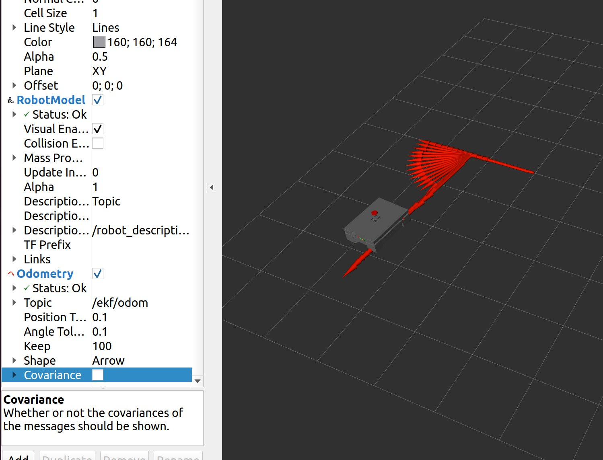
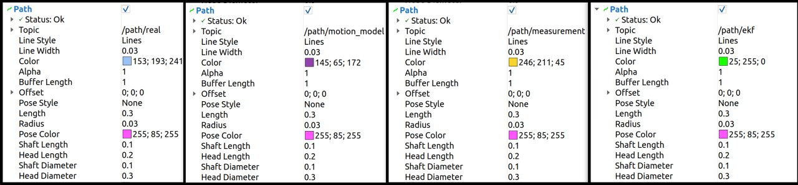
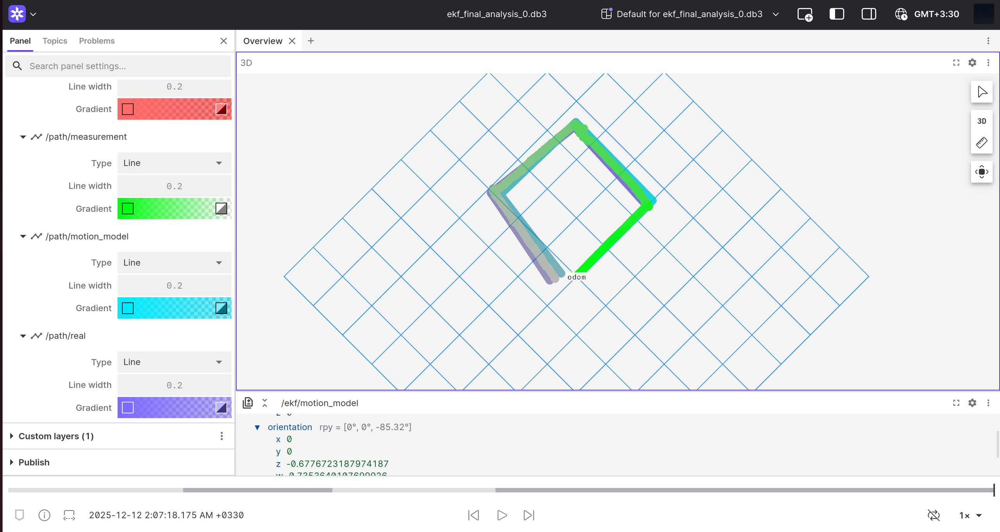

# RobotLocalization_EKF_ROS2_SUT

An Extended Kalman Filter for a skid-steer robot, deliberately split into four independent ROS 2 nodes (prediction, measurement fusion, correction, and path comparison) instead of one monolithic filter, so each stage of the algorithm can be inspected, verified, and plotted against the others in RViz.

## What it does

- Models the robot as a 3-state unicycle-style system `[x, y, θ]` driven by `[v_x, ω_z]`, with the standard EKF prediction/correction equations (motion model, Jacobians, covariance propagation) implemented from the linear algebra up, not pulled from a library like `robot_localization`.
- **`prediction_node.py`** integrates `/cmd_vel` through the discrete-time kinematic model (handling straight-line motion and turning-radius motion as separate cases) and publishes the predicted pose + covariance as `nav_msgs/Odometry` on `/ekf/motion_model`.
- **`measurement_node.py`** fuses two independent sensors into one measurement vector: position `(x, y)` from simulated visual odometry (`/vo/odom`) and yaw `θ` from a noisy IMU (`/zed/zed_node/imu/data_raw`), building the combined covariance block-diagonally from each sensor's own noise.
- **`ekf_node.py`** is the actual filter: it takes the prediction node's output as its time update and the measurement node's output as its correction, running the innovation/Kalman-gain/state-update cycle at 100Hz and publishing the fused estimate on `/ekf/odom`.
- **`path_tracker_node.py`** drives the robot around a fixed square path and simultaneously records ground truth, raw measurement, motion-model-only, and EKF-fused paths as four separate `nav_msgs/Path` topics, so all four can be overlaid in RViz to see the filter's effect directly.
- A custom C++ `MotorControllerNode` converts `/cmd_vel` into independent left/right wheel angular velocities via inverse kinematics, replacing Gazebo's built-in diff-drive plugin so the simulated robot is actually driven the way a real skid-steer platform with independent wheel RPM control would be.
- IMU gyroscope and accelerometer noise (Gaussian, with bias terms) is explicitly configured in the URDF rather than left at Gazebo's noiseless default, so the EKF has something real to correct for.

## Why it's interesting

Splitting the EKF into separate prediction/measurement/correction nodes instead of one script is what makes the "does the filter actually help" question answerable rather than assumed: because `path_tracker_node` records the motion-model-only path and the raw-measurement path as their own topics alongside the fused EKF path, the recorded rosbag directly shows the EKF path drifting less than dead reckoning and being less noisy than the raw sensor fusion, rather than just asserting it. That same rosbag was replayed in Foxglove for a quantitative X/Y error-over-time comparison across all three estimates.

The measurement node also has to reconcile two sensors that don't agree on what they're measuring: the visual-odometry source reports a spurious nonzero Z position for a ground robot, which is deliberately zeroed out rather than fed into a 3-state planar filter that has no way to represent it. And because prediction and correction run as separate nodes on separate topics, the EKF node has to explicitly re-extract a 3x3 covariance submatrix from the 6x6 `Odometry` message covariance it receives from the prediction node — a detail that disappears entirely in a single-file EKF implementation but has to be handled correctly here.

## Tech stack

ROS 2 (`rclpy` for the four Python EKF-pipeline nodes, `rclcpp` for the C++ motor controller and odometry nodes), Gazebo (via `ros_gz_bridge`) for simulation with a URDF-modeled skid-steer robot, RViz for live path visualization, `rosbag` + Foxglove for offline quantitative analysis.

## Getting started

Requires a ROS 2 workspace with Gazebo and `ros_gz_bridge` installed.

```bash
colcon build
source install/setup.bash
ros2 launch robot_description gazebo.launch.py
ros2 launch robot_description display.launch.py
```

Run the EKF pipeline (each is a separate node so you can watch any stage in isolation):

```bash
ros2 run robot_local_localization prediction_node
ros2 run robot_local_localization measurement_node
ros2 run robot_local_localization ekf_node
ros2 run robot_local_localization path_tracker_node   # drives a square path and records all 4 paths
```

Open RViz and add `/ground_truth_odom`, `/measurement_model/odom`, `/ekf/motion_model`, and `/ekf/odom` as Path/Odometry displays to see them diverge or converge live.

## Architecture

Sensor data flows one direction only: `prediction_node` reads control input, `measurement_node` reads and fuses raw sensors, and `ekf_node` is the only place the two streams meet — it never talks to a sensor or the robot directly, only to the other two nodes' published `Odometry` messages. This keeps each piece testable independently (you can verify the motion model traces a sane path with no measurements running at all) at the cost of extra per-cycle marshaling, like reconstructing a 3x3 covariance from a 6x6 message field by field.

### Verification

The prediction node's dead-reckoning trace, the noisy IMU readings at rest, and the final four-path comparison (ground truth vs. measurement vs. motion model vs. EKF) were all verified visually in RViz:




